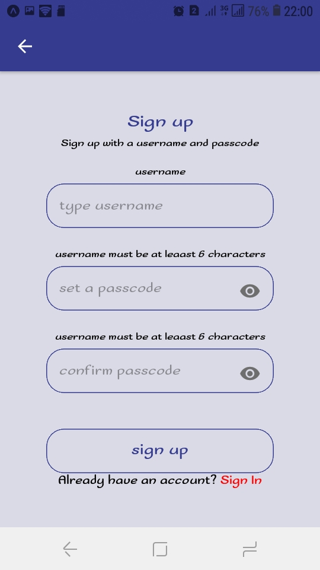
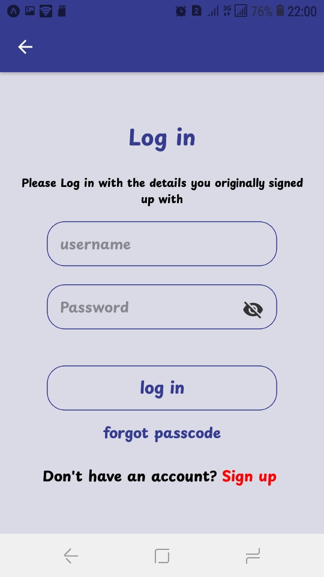
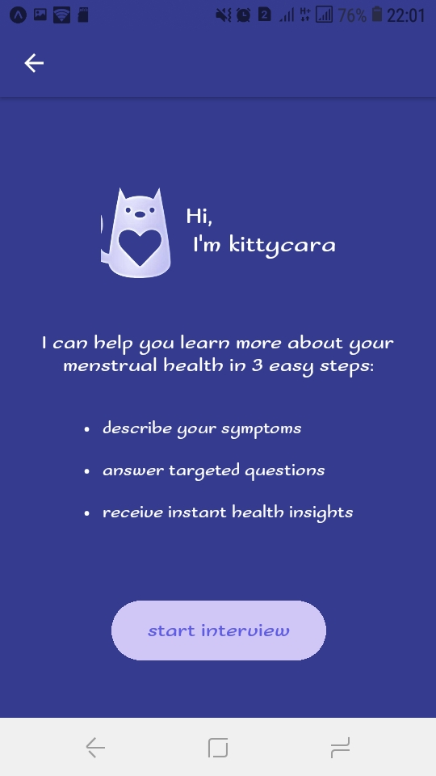

# kittyCara AI
Kittycara AI is a mobile app designed to assist adolescent girls and their caretakers in diagnosing potential menstrual disorders based on the symptoms they provide. The app utilizes OpenAI API and features a friendly pet cat interface to make the experience approachable and user-friendly. It's especially useful in Sub-Saharan Africa, where cultural stigmas and a lack of gynecological education often prevent girls from seeking timely medical care.

Features
.**AI-Powered Symptom Diagnosis**: Kittycara AI leverages the OpenAI API to assess menstrual patterns and symptoms, offering insights into potential disorders.
.**User-Friendly Pet Interface**: The app is designed as a pet cat to create a warm and engaging experience for adolescent users.
. **Focus on Sub-Saharan Africa**: Tackles the challenges related to cultural stigma, embarrassment, and lack of education around menstruation and gynecological care.

### Screenshot

    

        
Screenshots home

        
        
        
    

    

        
Sign up

        
        

    

        
Log in and Welcome

        
        
        

## How to Use This Repository:

- Clone this repository to your local machine.
- npm install.
- npx expo start

Explore code examples for an in-depth understanding of each development phase.

## Prerequisites:
## Getting Started
Prerequisites
To run this project, you need to have the following installed:

Node.js
npm or yarn
Expo CLI
An OpenAI API Key (if you haven't already, sign up for access at OpenAI)
Basic knowledge of JavaScript and React Native.
Familiarity with Python and setting up FastAPI.
Contributions:
Contributions are encouraged! Whether it's bug fixes, new features, or improvements, feel free to open a pull request.

- Clone :

        https://github.com/bambadij/kittycaraApp.git
        
        cd kittycaraApp

- start : 

        npm install or yarn
        npx expo start
